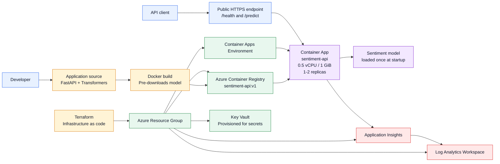
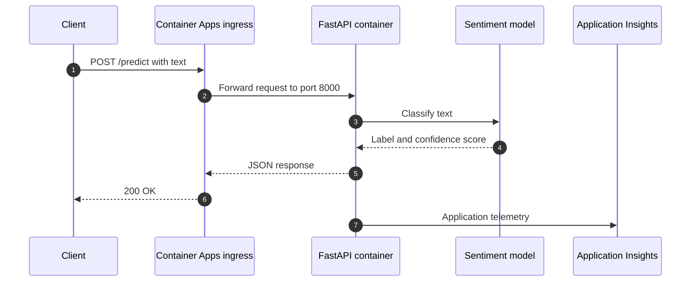

# Architecture

## Current deployed architecture

This project serves a Hugging Face sentiment-analysis model through a FastAPI API running in Azure Container Apps. Terraform provisions the Azure resources.

## Runtime request flow

## What is deployed today

- FastAPI inference service with `/health` and `/predict`
- Docker image stored in Azure Container Registry
- Azure Container App with external HTTPS ingress
- Autoscaling range of 1 to 2 replicas
- Application Insights connected to Log Analytics
- Key Vault resource provisioned for future secret-management work
- Terraform-managed Azure infrastructure

## Important scope note

The current project is an ML inference API, not an LLM chat application. The next roadmap phase can add an LLM serving layer, followed by RAG, evaluation, monitoring, and cost controls.
